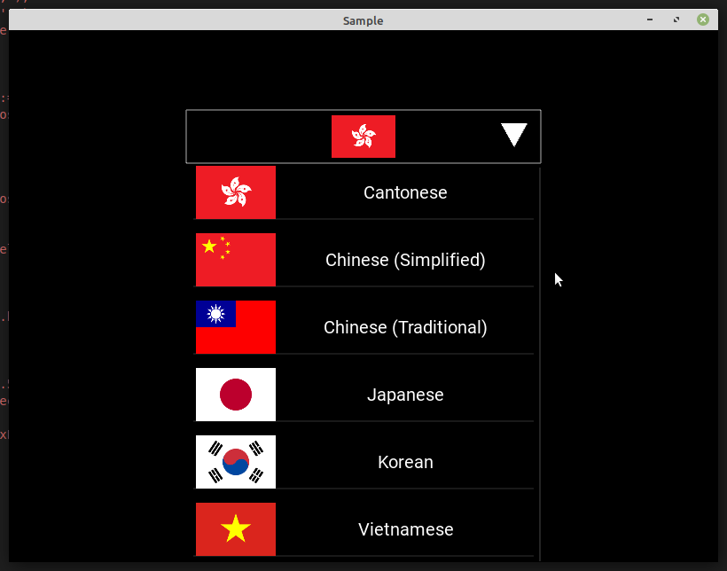

# KXSpinnerLikeBehavior

Mix-in class that helps to create your own spinner. [Youtube](https://youtu.be/baaHGwk8GnQ).



Unlike the official one, this one can be combined with any widget as long as an `on_release` event is properly implemented. For example:

```python

class Spinner1(KXSpinnerLikeBehavior, Button):
    ...
class Spinner2(KXSpinnerLikeBehavior, ButtonBehavior, Image):
    ...
class Spinner3(KXSpinnerLikeBehavior, ButtonBehavior, BoxLayout):
    ...
```

And the `option_cls` doesn't have to have a `text` property so the following classes are all valid.

```python
class SpinnerOption1(ButtonBehavior, Image):
    ...
class SpinnerOption2(ButtonBehavior, BoxLayout):
    ...
spinner.option_cls = SpinnerOption1
spinner.option_cls = SpinnerOption2
```

## Installation

```
pip install git+https://github.com/gottadiveintopython/kivyx.uix.behavior.spinner#egg=kivyx.uix.behavior.spinner
```
## LICENSE

MIT

## Tested on

- CPython3.8.12 + Kivy2.1.0
